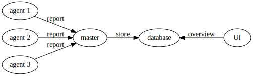
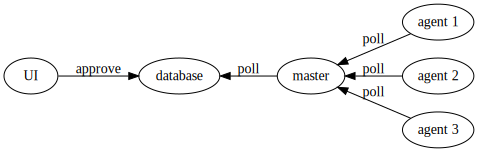

## What is Masif Upgrader?

*Masif* is a given name derived from the word *massive*
by the creator of **Masif Upgrader**.

*Masif Upgrader* stands obviously for *massive upgrader*.
It's a distributed update manager designed to simplify
updating packages on large amounts of hosts.

## Architecture

Every host managed by Masif Upgrader runs the Masif Upgrader *[agent]*.
That agent monitors whether any new versions
of installed packages are available.

Once anything can be upgraded, the agents report all actions to be performed
to the *[master]*.
The master stores these actions in a MySQL database shared with the *[UI]*.

With all that data stored centrally the administrator of the managed hosts
can overview the actions to be performed by the package manager
across all hosts via the UI:

 Package, agents awaiting approval | Action    | Target version
 ----------------------------------|-----------|----------------
 perl, 23                          | Update    | 5.24.1-3+deb9u4
                               | Configure | 5.24.1-3+deb9u4

Actions the admin agrees with can be approved (across all hosts at once)
by just ticking the respective checkboxes
and clicking *Approve selection* in the UI.

The agents poll the master for approved actions and execute them once approved.

## Requirements

### A MySQL database

Both the UI and the master must be able
to SELECT, INSERT, UPDATE and DELETE from the database.

The master must also be able to create tables during schema auto-import.

### A custom X.509 PKI

Some applications e.g. [Puppet] and [Icinga 2] already provide such PKIs.
Masif Upgrader can use them concurrently to the providing application
if the hosts running Masif Upgrader
are a subset of hosts running Puppet or Icinga 2.

If a such application is missing, a PKI must be generated manually,
e.g. with [easy-rsa]:

* Every host an agent or master runs on needs an X.509 certificate
  for communicating with others via TLS.
* All certificates shall fulfill the usual requirements for HTTPS communication
  as the master is an HTTPS server and the agents are clients.
* All agents' certificates shall be signed with the same root CA
  and have distinct CNs as they're identified by their CN.

## Setup

Once all requirements described above are fulfilled,
Masif Upgrader's components can be set up one by one. Recommended order:

1. [master]
2. [agents][agent]
3. [UI]

[agent]: https://github.com/masif-upgrader/agent
[master]: https://github.com/masif-upgrader/master
[UI]: https://github.com/masif-upgrader/icingaweb2-module-masifupgrader
[Puppet]: https://puppet.com/docs/puppet/5.5/architecture.html#communications-and-security
[Icinga 2]: https://www.icinga.com/docs/icinga2/latest/doc/06-distributed-monitoring/#security
[easy-rsa]: https://github.com/OpenVPN/easy-rsa
